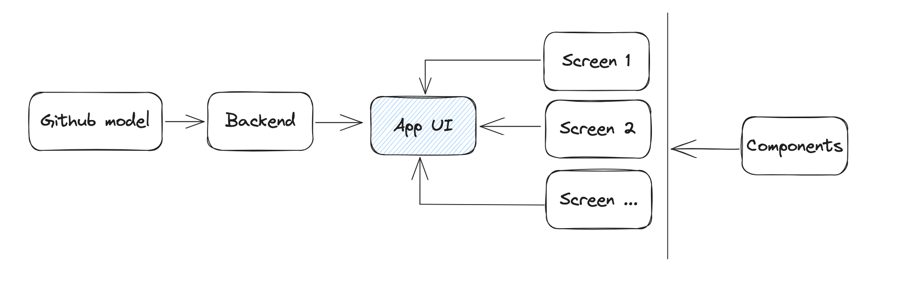

# Virtual Try-ons

## Source code explain
```
.
├── Dockerfile                      # Docker build file
├── README.md                       # Document (this file)
├── app.py                          # Main UI application
├── assets                          # Images for README
├── backend                         # Backend logic (load data and model)
│   ├── __init__.py
│   ├── dressing_in_order           # Raw dressing_in_order grom Github with some modify
│   ├── dataset.py                  # Load dataset and helper function
│   └── model.py                    # Load model and model helper function
├── components.py                   # Components for UI
├── constants.py                    # Some contanst for UI
├── dress_in_order_demo.ipynb       # Demo notebook
├── images                          # Demo images
├── requirements.txt                # Python dependenceies 
├── screen                          # UI screen
│   ├── __init__.py
│   ├── layer_try_on.py             # Layer try-on screen
│   ├── layer_try_on_multi.py       # Multiple layer try-on screen
│   ├── pose_transform.py           # Pose transform screen
│   └── vitural_try_on.py           # Virtual try-on screen
└── style.css                       # Some custom css
```

## Source code logic




## Customble style

- Size of image selector and result Image:
```py
# constants.py
IMAGE_SELECTOR_HEIGHT = "180px"
RESULT_IMAGE_SIZE = 500
```

- App style (background color,..)
Remember to select custom theme in streamlit UI setting
```yaml
# /streamlit/config.toml
[theme]
primaryColor="#6eb52f"
backgroundColor="#f0f0f5"
secondaryBackgroundColor="#e0e0ef"
textColor="#262730"
font="sans serif"
```

## Build and run with Docker
- What is Docker?
In short it a tool that help pack the application and can run on any Docker installed machine
- How to build ?
On the root path run
```
docker build try-on .
```
- When I need build again?

Whenevenr you change something in the source code

- How to run?
```
docker run -p 8501:8501 try-on
```
You can also run a pre-builded image using
```
docker run -p 8501:8501 tsdocode/try-on
```
- How to see the web?
```
http://localhost:8501
```
